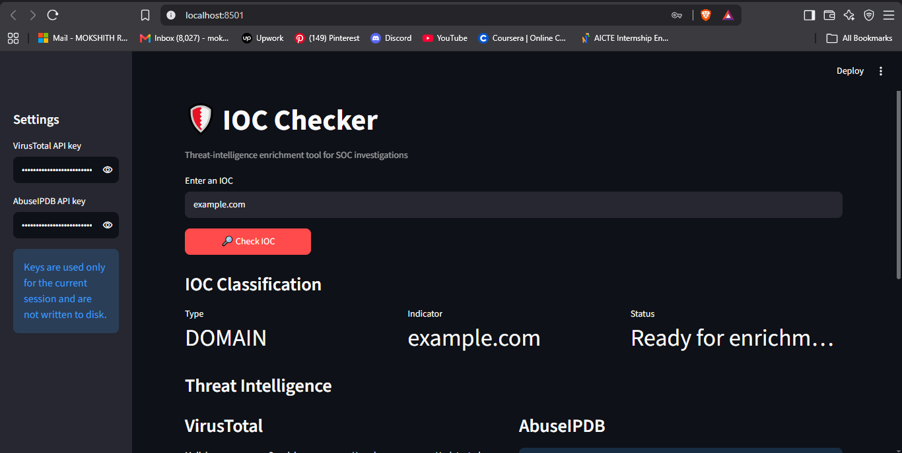
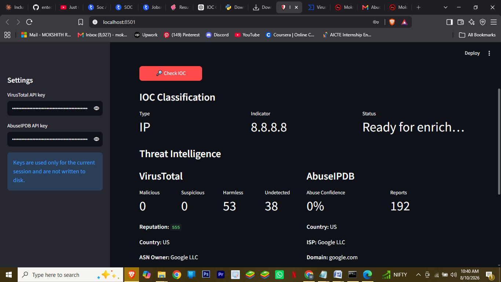
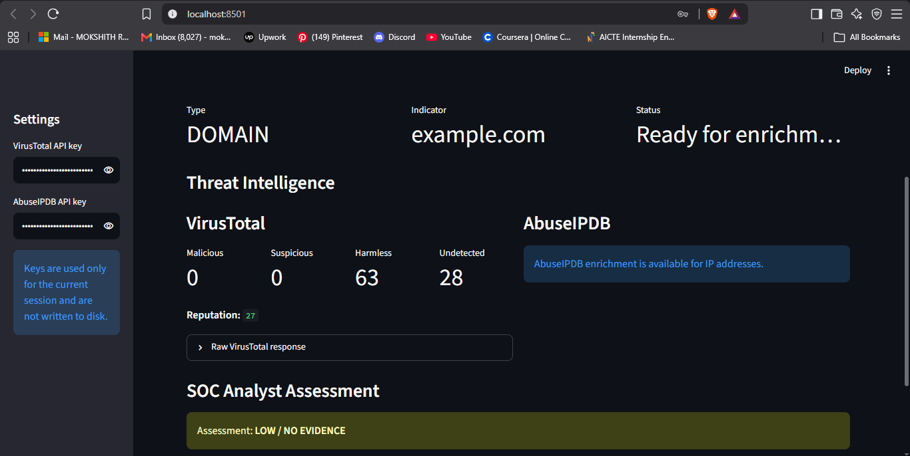
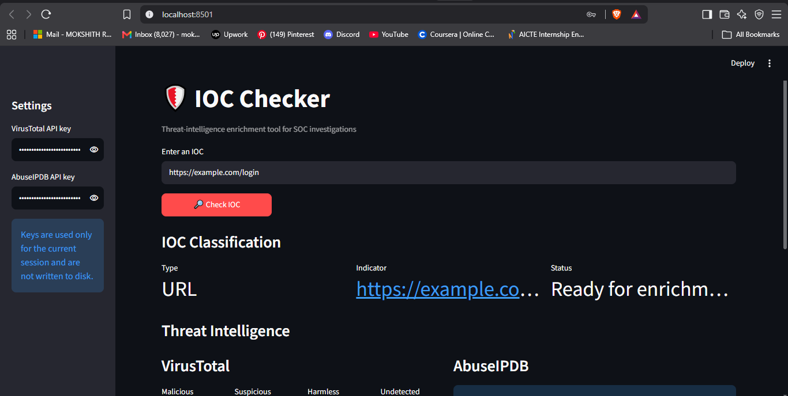
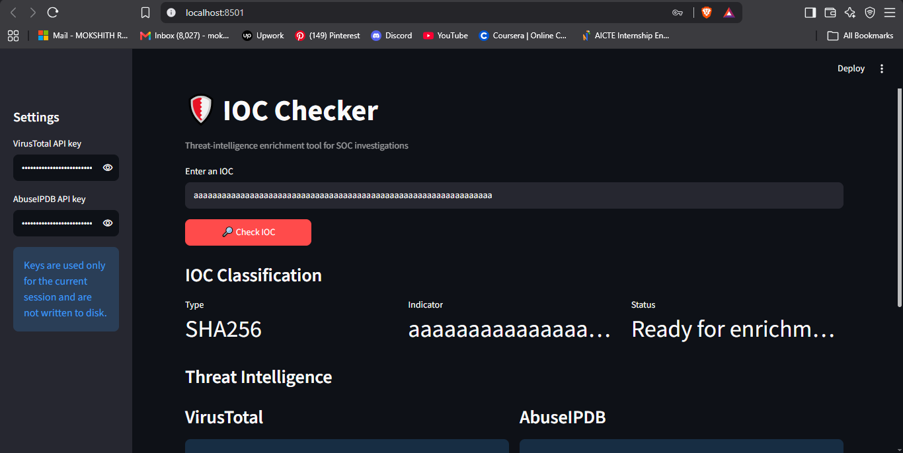
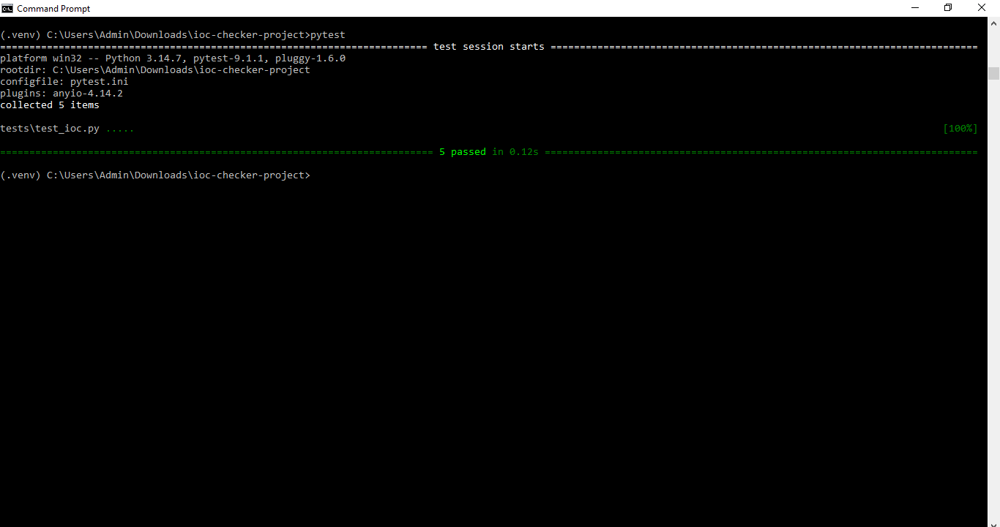

# IOC Checker — SOC Threat Intelligence Enrichment Tool

A beginner-friendly cybersecurity project that identifies Indicators of Compromise (IOCs) and enriches them with public threat-intelligence sources.

## Features

- Detects IPv4/IPv6 addresses
- Detects MD5, SHA-1 and SHA-256 hashes
- Detects domains and URLs
- VirusTotal API v3 enrichment
- AbuseIPDB API v2 enrichment for IP addresses
- Simple SOC risk heuristic
- Raw JSON inspection for analyst validation
- Unit tests for IOC classification
- Streamlit web interface

## Architecture

User IOC → IOC Classifier → Threat Intel APIs → Normalized Results → Risk Heuristic → SOC Dashboard

## Run locally

```bash
python -m venv .venv
# Windows:
.venv\Scripts\activate
# macOS/Linux:
source .venv/bin/activate

pip install -r requirements.txt
streamlit run app.py
```

Open the local URL printed by Streamlit.

## API keys

The project supports optional API keys entered into the sidebar at runtime.

- VirusTotal: https://www.virustotal.com/
- AbuseIPDB: https://www.abuseipdb.com/

## 📸 Screenshots

### 1. IOC Classification

The tool identifies the type of IOC entered by the analyst.



### 2. Threat Intelligence Enrichment

The IOC is enriched using VirusTotal and AbuseIPDB where applicable.



### 3. Domain Analysis

The tool can also analyze domain indicators.



### 4. URL Analysis

URL indicators can be classified and enriched through VirusTotal.



### 5. Hash Analysis

The tool supports hash-based indicators including SHA-256.



### 6. Automated Tests

The IOC classification tests successfully passed.



## Safe testing

Use benign indicators such as:

- `8.8.8.8`
- `example.com`
- `https://example.com`
- a known test hash from a vendor/documentation page

Do not upload or submit private company data, confidential URLs, or real malware samples.


